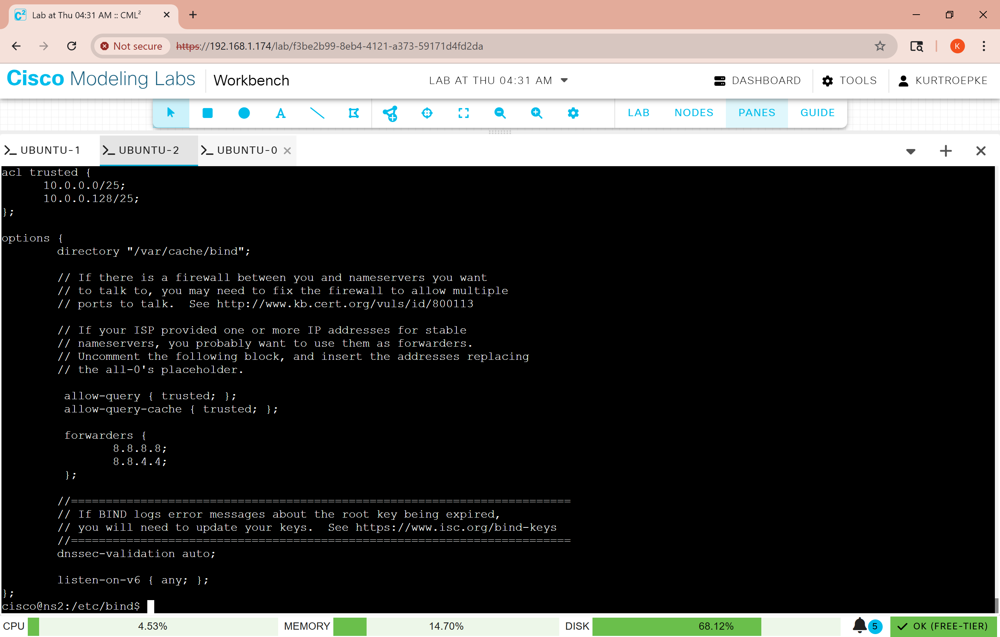

<h1> Secondary bind9 dns server</h1>

 

<h2>Description</h2>
 In this project, I add a secondary DNS server to an existing topology for network redundancy.
 

<h2></h2>

<h2>Environments and programs used </h2>

- <b>Cisco CML 2.8</b> 

- <b>Cisco cli</b>

- <b>Ubuntu terminal</b>

<h2>Program walk-through:</h2>

Topology in use  
  

  
 The topology we are using has two subnets, an inside interface, and a DMZ connected to 
 An ASA firewall is connected to the outside network. 
 
 
Install updates 
  

  
  Update Ubuntu using sudo apt-get update before installing bind9. 
 
 
Install bind9 
  

 
 
named.conf.options 
  

 
Set up the named.conf.options file with an ACL so that only permitted clients can access this
DNS server. This is also where we allow queries and set up forwarders. This file 
 will be set up similarly to the master server. 
 
 
named-checkconf
  

  
 To check the syntax of our files, use named-checkconf followed by the 
file name. 
 
 
Declare zones on secondary dns  
  

  
 Here, we have to tell the secondary server where to find the updates for
 The zone, so we have to tell it what the primary IP is and what the file name is
 on the primary server. 
 
 
 Zone transfer from primary server 
  

  
 We have to tell the primary server the address of the secondary server so it knows 
 where to send the copy of the zone file. I'm also going to allow the primary server to
 notify the secondary server when changes happen.  
 
 
Test functionality  
  
 
  
Finally, on a client pc, change the nameserver in the netplan file to use only the secondary
 server. I can resolve domain names from my zone, so it is working. 
 
 

